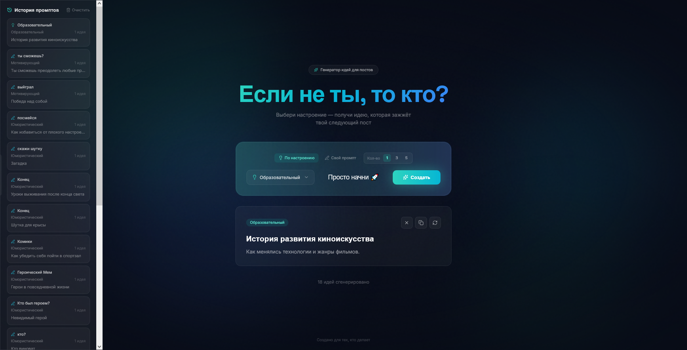

```markdown
# 🧠 Генератор идей для постов

**Генератор идей для постов** — это веб-приложение, которое помогает контент-мейкерам, SMM-менеджерам и блогерам быстро находить темы для публикаций с помощью AI.

Проект создан в рамках стажировки **Vibe Coding**.

---

## 🖼️ Скриншот

![Интерфейс генератора идей]

---

## ✨ Возможности

- Выбор тональности (юмористический, мотивирующий, деловой и др.)
- Режим «Свой промпт» — введи свою тему
- Генерация идей с помощью AI (OpenRouter / GPT-3.5-turbo)
- Автоматическая запасная генерация (если AI недоступен)
- Генерация до 5 идей за раз
- Копирование идеи в буфер обмена
- Удаление отдельных карточек
- История промптов (сохраняется до 20 записей)
- Адаптивный дизайн (работает на ПК и мобильных)

---

## 🛠️ Стек технологий

| Компонент | Технология |
|-----------|------------|
| Фронтенд | React 18, TypeScript, Tailwind CSS, Vite |
| Бэкенд | Node.js, Express |
| AI API | OpenRouter (GPT-3.5-turbo) |
| Иконки | Lucide React |
| Деплой | Vercel |

---

## 📁 Структура проекта

```
IdeaGen/
├── server/                # Бэкенд-прокси для OpenRouter
│   ├── server.js
│   └── package.json
├── src/                   # Фронтенд
│   ├── api.ts             # Интеграция с AI
│   ├── app.tsx            # Главный компонент
│   ├── components/
│   └── data/
├── tutorial/              # Скриншоты и ТЗ
│   └── images/
├── .env                   # API-ключ (не пушится)
├── .gitignore
├── package.json
├── vite.config.ts
└── README.md
```

---

## 🚀 Запуск проекта локально

### 1. Клонируй репозиторий

```bash
git clone https://github.com/BlueLock-wasd/post-ideas-generator.git
cd post-ideas-generator
```

---

### 2. Установи зависимости для фронтенда

```bash
npm install
```

---

### 3. Установи зависимости для сервера

```bash
cd server
npm install
cd ..
```

---

### 4. Создай файл `.env` в корне проекта

В папке `IdeaGen/` создай файл `.env` и добавь:

```
VITE_OPENROUTER_API_KEY=твой_ключ_от_openrouter
```

**Где взять ключ:** зарегистрируйся на [OpenRouter](https://openrouter.ai) и создай API-ключ в разделе **Keys**.

---

### 5. Запусти бэкенд-сервер (в отдельном терминале)

```bash
cd server
node server.js
```

Сервер запустится на `http://localhost:3001`

---

### 6. Запусти фронтенд (в другом терминале)

```bash
npm run dev
```

Открой `http://localhost:5173` в браузере.

---

### 7. Проверка работы AI

- Если AI отвечает — ты увидишь сгенерированные идеи.
- Если AI недоступен — автоматически сработает запасная генерация из встроенной базы идей.

---

## 🤖 Как работает AI

1. Пользователь выбирает тональность или вводит свой промпт.
2. Нажимает «Создать».
3. Запрос отправляется на локальный сервер (`http://localhost:3001/api/generate`).
4. Сервер проксирует запрос в OpenRouter (модель `gpt-3.5-turbo`).
5. Ответ парсится на заголовок и описание.
6. Если AI недоступен — используется запасная генерация.

---

## 🧩 Запасная генерация

Встроенный банк идей (более 10 идей по 7 тональностям) используется, если:
- AI не отвечает (ошибка сети или API)
- Не указан ключ в `.env`
- Сервер не запущен

---

## 📝 Примеры промптов

| Режим | Промпт |
|-------|--------|
| Тональность | `Сгенерируй 3 идеи для поста с тональностью "мотивирующий".` |
| Свой промпт | `Сгенерируй 1 идею для поста на тему: "продуктивность". Тональность: "деловой".` |

---

## 👨‍💻 Автор

**Захар Мищенко**  
- [GitHub](https://github.com/BlueLock-wasd)
- [Kwork](https://kwork.ru/user/zahar_vladimirovich)

---

## 🙏 Благодарности

- [OpenRouter](https://openrouter.ai) — за доступ к AI-моделям
- [Lucide](https://lucide.dev) — за красивые иконки
- [Tailwind CSS](https://tailwindcss.com) — за удобную стилизацию
```

