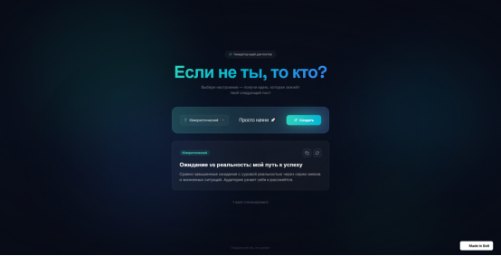
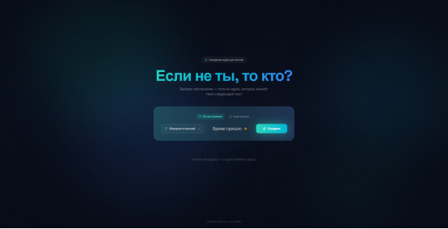
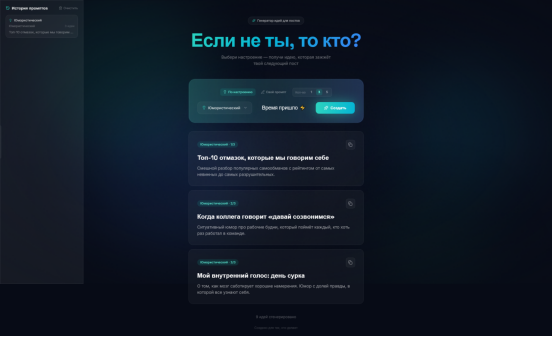

# Техническое задание: Генератор идей для постов

## 1. Целевая аудитория
- **Кто:** Контент-мейкеры, SMM-менеджеры, блогеры, маркетологи, предприниматели, ведущие личные блоги.
- **Их боли:** Тратится слишком много времени на придумывание тем для постов; идеи часто повторяются; сложно выбрать тональность, которая зайдёт аудитории.
- **Потребность:** Получить 1-2 готовые, цепляющие темы для поста за 10 секунд, чтобы сразу начать писать.

## 2. User Stories (Сценарии использования)
- **Как контент-мейкер**, я хочу выбрать тему (через тональность), чтобы получить идею, которая соответствует моему стилю и вызывает эмоции у моей аудитории.
- **Как пользователь**, я хочу ввести свою тему (свой промпт), чтобы получить идею, связанную с моей конкретной нишей, а не общую.
- **Как пользователь**, я хочу скопировать идею одним кликом, чтобы не переписывать её вручную.
- **Как пользователь**, я хочу видеть процесс генерации (анимация загрузки), чтобы понимать, что система работает.

## 3. Структура данных (MVP)
```typescript
interface Idea {
  title: string;       // Заголовок поста
  description: string; // Описание/план поста
}

interface Tone {
  id: string;          // Уникальный идентификатор
  label: string;       // Человекочитаемое название
}

4. Основные сценарии работы интерфейса

   - Пользователь выбирает тональность (или вводит свою тему).

   - Нажимает кнопку «Создать».

   - Видит анимацию загрузки.

   - Получает готовую идею (заголовок + описание).

   - Может скопировать идею в буфер обмена или сгенерировать новую.

5. Технологии

   - React + TypeScript + Vite

   - Tailwind CSS

   - Деплой: Vercel / Bolt

6. Промпты для (bolt.new), использованные в разработке

1. **Первый промпт**  
   ![Генерация интерфейса: Создай стеклянный современный дизайн и на фоне баланс цветов для лёгкого восприятия глаз, 
   а так же залипательный и минималистичный интерфейс дающий ощущение свободы.
   Тематика сайта: Генерация идей для постов
   В центре сайта находится блок в котором будет мотивирующий текст из типа "Взял и сделал🐱‍👤" и привлекательная 
   кнопка внутри блока с правой стороны "Сгенерировать"
   слевой стороны выпадающий список который позволяет выбрать надстройку "юмористический, мотивирующий, деловой и т.п."
   А над блоком находится Заголовок который зазывающе спрашивает "Если не ты, то кто?"]
   

2. **Второй промпт**  
   ![Добавление пользовательского ввода: исправь выпадающий список и сделай блок который позволяет создавать промпт 
   самому пользователю и отправлять его помимо надстройки со списком]
   
   
3. **Генерация идеи**  
   ![Улучшение UX и истории: измени dropdown что бы после генерации идеи список не закрывался 
   появившимся блоком + историю запросов с левой стороны добавь стеклянное окошко 
   которого не будет видно пока не наведёшь на него мышкой в которой будет храниться 
   история промптов и добавь возможность создавать до 5 идей за раз]
   
   
---

### 4. **План на День 2**
```markdown
## План на День 2
1. Интеграция AI API (DeepSeek/OpenAI/Gemini) — замена статических идей на реальную генерацию.
2. Добавление обработки ошибок (ошибки API, пустые ответы).
3. Деплой на Vercel.
4. Подготовка презентации.